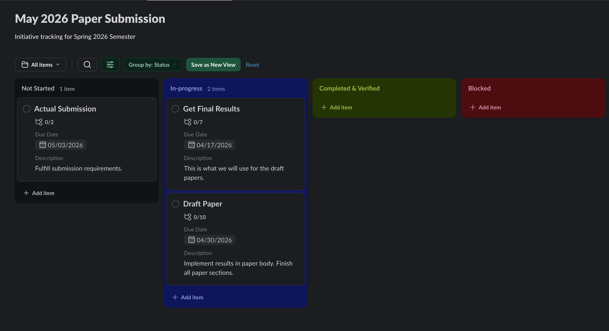
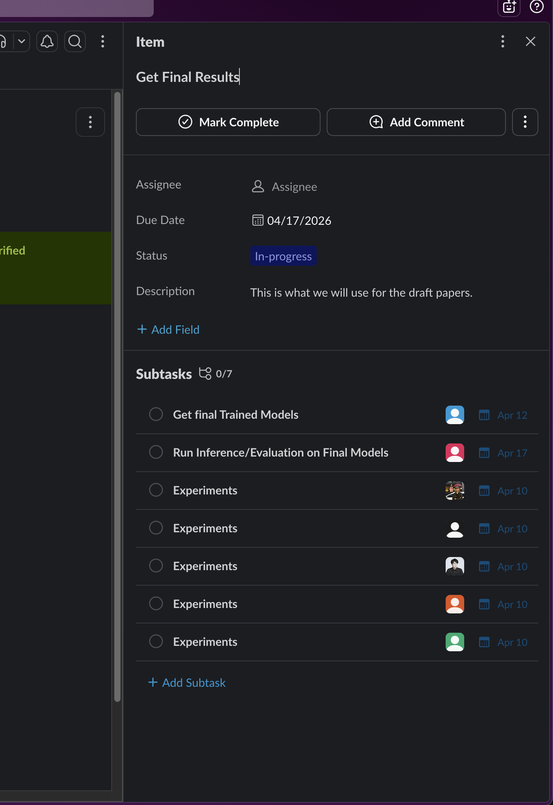

# Management & Leadership in CS — Final Written Report

## Initiative: Goal-First Tracking for Research Team Managers

### Scope

This initiative introduces a goal-first tracking methodology for research team managers at HAAG. Instead of tracking what each researcher is doing, the system makes team-level goals the primary unit of tracking. Work is organized into three levels (Initiatives, Goals, and Tasks) and tracked on a Slack Lists Kanban board that the manager sets up and maintains.

The intended audience is team managers. Researchers, computational advisors, and professors benefit from the framework and can engage with it to whatever degree works for their team. The operational burden sits entirely with the manager. Everything runs inside Slack, no new tools are required, and a new manager can have tracking set up within minutes of their first week.

### Evidence of Alignment with HAAG's Goals

The initiative was introduced to the CDDM research group through a kickoff meeting with the primary manager, where the Slack Kanban board and goal-first methodology were walked through in detail. The lead researcher noted that the existing PDF-based weekly progress report takes too much time for the value it provides. This aligns with the initiative's goal of reducing reporting overhead while improving visibility. The faculty advisor expressed support for the general approach.

Semi-weekly syncs with the lead researcher were established to review goal progress. By the time the procedure was fully solidified, the CDDM team was already in the final phases of paper writing. Introducing a new tracking workflow at that stage would have caused a non-trivial disruption to a team sprinting toward submission. This procedure is best suited for newer teams that are still establishing their workflows, not mature teams in the final stretch before a deadline.

Observations throughout the semester reinforced the need for this kind of system. One example: a multi-week delay occurred when the team had to pivot research directions without structured goal-level visibility. The HAAG Progress Tracking System already emphasizes visibility and progress monitoring. This initiative adds a structured, goal-oriented layer that complements existing reporting and escalation workflows.

### Procedures Generated

This report contains one procedure: the Goal-First Tracking Standard Operating Procedure (SOP) for Research Team Managers. The purpose of this SOP is to give any current or future HAAG manager a complete, step-by-step guide to implement and maintain goal-first tracking using Slack Lists. It covers initial setup, ongoing operations, board maintenance, sync meeting structure, researcher expectations, administrative reporting, and success metrics. The SOP is self-contained and reproducible without outside context.

The full SOP follows below.

---
---

# Standard Operating Procedure: Goal-First Tracking for Research Team Managers

**Document Type:** Standard Operating Procedure (SOP)
**Intended Audience:** Research Team Managers at HAAG
**Version:** 1.0
**Date:** April 2026

---

## Purpose

This SOP gives you a step-by-step guide to implement and maintain a goal-first tracking system using Slack Lists (Kanban). The system shifts progress tracking from individual researcher activity to team-level goal achievement. You, the manager, are the primary operator. Researchers, computational advisors, and professors benefit from the framework but are not expected to maintain it.

---

## Background

Traditional research team tracking is researcher-first. Meetings and documentation focus on what each person did. This does not reliably tell you whether the team is on track to meet its goals. A researcher can be busy and productive while a key deliverable quietly falls behind.

The goal-first approach fixes this by making goals the primary unit of tracking. You maintain the board, run short syncs, and use the board state to identify risks early.

---

## Key Concepts

### Work Hierarchy

All work is organized into three levels:

**Initiatives → Goals → Tasks**

- **Initiatives** are the high-level outcomes the team is working toward over a semester or longer. They define what success looks like. Examples: publish a paper, speak at a conference, develop a novel model architecture.
- **Goals** are concrete, measurable deliverables that move the team closer to completing an Initiative. Each Goal must logically connect to an Initiative. If you can't draw a clear line from a Goal to an Initiative, reconsider the Goal. Examples: close the chamfer distance to an acceptable publishing threshold, complete a literature review, submit a test paper.
- **Tasks** are smaller units of work done to achieve a Goal. Tasks are assigned to individual researchers and tracked on the board under their parent Goal. They are not the primary unit of measurement, but completed tasks are how you track incremental progress toward a Goal.

### Core Principle

**We are research-focused, not researcher-focused.** Assume all researchers are fulfilling their duties. Only when goal tracking begins to falter should you examine individual contributions. Focus on whether goals are being achieved, not on tracking individual tasks.

---

## Tools Required

- **Slack** (workspace must already exist for the research team)
- **Slack Lists** (built into Slack, no additional installation required)

Team communication, goal tracking, and work artifacts all live in one place. No external tools or complicated setup needed.

---

## Procedure

### Phase 1: Initial Setup (First Week)

**Estimated time:** 30 to 45 minutes (Steps 1 through 4), plus a 30 to 45 minute kickoff meeting (Step 5)

#### Step 1: Define Initiatives

Meet with the lead researcher and/or professor to identify the team's high-level outcomes for the semester.

- Ask: "What does success look like for this team by the end of the semester?"
- Write down 1 to 2 Initiatives. Keep them broad but concrete enough to evaluate.
- Examples: "Publish paper on X," "Submit to Y conference," "Complete prototype of Z."

#### Step 2: Break Initiatives into Goals

For each Initiative, identify the concrete deliverables that would move the team closer to completion.

- Each Goal should be something you can point to and say "this is done" or "this is not done."
- Aim for 2 to 4 Goals per Initiative to start. You can add more later.
- Label each Goal with a prefix to indicate its type:
  - **[Epic]** Large, multi-week deliverables
  - **[Goal]** Standard deliverables (days to weeks)
  - **[Spike]** Investigation or research work with uncertain outcomes
  - Use other labels as needed for your team.

#### Step 3: Create the Slack Lists Kanban Board

1. Open the Slack channel for your research team.
2. Create a new Slack List (click the "+" icon in the channel header or use the Slack Lists feature).
3. Name the board after the team's primary Initiative (e.g., "CDDM: Publish 3D Generative Model Paper").
4. Set up the following columns:

| Column | Purpose |
|---|---|
| **Not Started** | Goals that are planned but work has not begun |
| **In Progress** | Goals that are actively being worked on |
| **Completed** | Goals where the researcher considers the work done (optional, can be merged with Verified) |
| **Verified** | Goals reviewed and confirmed by the professor or computational advisor |
| **Blocked** | Goals that cannot proceed due to a dependency, resource issue, or other obstacle |

**Note:** You can use "Completed" and "Verified" as a single column or keep them separate. If separate, you move items to "Completed" when work is done, and the professor or advisor moves them to "Verified."

#### Step 4: Load Goals onto the Board

- Create a card for each Goal.
- Place all cards in "Not Started" initially.
- Assign each Goal to the responsible researcher(s).
- Add relevant context to each card: links, notes, related Slack threads, or reference materials.

#### Step 5: Introduce the Board to the Team

Hold a brief kickoff meeting (30 to 45 minutes) with the full team to:

- Walk through the board and explain the column structure.
- Explain that Goals are the primary unit of tracking, not individual tasks.
- Break each Goal down into tasks with the team. Assign each task to a specific researcher so ownership is clear. Tasks are not the primary unit of measurement, but completed tasks are how you track incremental progress toward a Goal.
- During syncs, closing completed tasks gives you a natural record of what each researcher accomplished that week. This serves as the basis for the weekly operational report you communicate to HAAG admins.
- Clarify that researchers only need to move their cards and give verbal updates during syncs. They don't need to write reports or maintain the board.
- Answer any questions.

**After this meeting, the board is live.**

---

### Phase 2: Ongoing Operations

#### Weekly/Bi-Weekly Sync Meeting

**Duration:** 15 minutes
**Attendees:** Manager, researchers, computational advisors/TAs (professor optional)

**Agenda:**

1. Start with the "Blocked" column. For each blocked Goal, identify the obstacle, assign ownership of the resolution, and set a target date.
2. Move to "In Progress." Ask researchers for a brief verbal update on each Goal. Close any completed tasks during this discussion.
3. Check "Not Started." Confirm priorities and whether any Goals should move to "In Progress."
4. Review "Completed." Confirm whether Goals are ready to move to "Verified."

**Guiding questions for every sync:**

- "Are we closer to our goal today than yesterday?"
- "Are we moving fast enough to meet our deadlines?"

**What NOT to do in the sync:**

- Don't ask each researcher to list every task they completed outside of the sync.
- Don't turn the sync into a status report meeting.
- Keep the focus on goal progress, not individual activity.

#### Asynchronous Board Maintenance (Your Responsibility)

Between syncs, you are responsible for:

- **Updating the board** with information from Slack conversations, meetings, and researcher updates.
- **Adding context** to Goal cards: link relevant Slack threads, attach documents, add notes from conversations.
- **Reorganizing Goals** as priorities shift. Add new Goals, archive completed ones, split large Goals if needed.
- **Watching for stalled Goals.** If a Goal has been "In Progress" for an extended period without visible movement, flag it for the next sync.

#### Researcher Expectations

Researchers are expected to:

- Move their Goal cards when status changes (e.g., from "Not Started" to "In Progress").
- Give brief verbal updates during the sync.
- Flag blockers as soon as they come up, either in Slack or during the sync.

Researchers are **not** expected to:

- Write progress reports for this system.
- Maintain the board or add context to cards.

#### Handling Administrative Reporting

If individual progress reports are required for grading or administrative purposes, you can build them from the board state. Tasks closed during each sync provide a clear record of what each researcher accomplished that week. This serves as the basis for the weekly operational report you communicate to HAAG admins. The board also records which goals each researcher is working on, what has been completed, and what is blocked. This removes the need for researchers to produce separate documentation.

---

### Phase 3: Board Review and Adjustment

At least once per month (or at natural semester checkpoints), you should:

1. **Review the full board** with the lead researcher or professor.
2. **Assess Initiative progress.** Are the completed Goals actually moving the team closer to the Initiative? Or is effort going toward work that doesn't connect?
3. **Adjust Goals.** Add new ones that have emerged, remove ones that are no longer relevant, re-prioritize as needed.
4. **Check pacing.** Are Goals moving through the board at a pace that will meet the semester deadline? If not, identify what is slowing things down.

---

## Board Screenshots

### Entire Board View

The full Kanban board with all columns visible. Each card represents a Goal, organized by status.

### Goal and Task Detail View

An individual Goal card with tasks listed underneath. Tasks are assigned to specific researchers and closed during syncs as work is completed.

---

## Success Metrics

Track the following KPIs over time to evaluate the effectiveness of the goal-first approach:

| KPI | What It Measures | How to Track |
|---|---|---|
| **Goal Achievement Rate** | Percentage of Goals completed on time relative to the semester timeline | Count Verified Goals vs. total Goals at end of semester |
| **Blocker Duration** | How long Goals remain in "Blocked" before resolution | Track dates when Goals enter and exit "Blocked" |
| **Researcher Sentiment** | How researchers feel about the method and tooling | Brief informal check-in or survey at end of semester |

---

## Integration with HAAG's Existing Structure

This system works within HAAG's existing tools and workflows:

- **Slack** is already the primary communication tool for all HAAG teams. The Kanban board lives inside the team's existing Slack channel.
- **Weekly meetings** already happen. The sync agenda replaces or supplements the existing meeting format. It does not add a new meeting.
- **Administrative reporting** can be derived from the board state, reducing duplication of effort.
- **Other HAAG initiatives** (e.g., blocker escalation protocols, weekly reporting standardization) complement this system. Blockers identified on the board can feed directly into escalation workflows.

No new tools need to be installed. No new accounts need to be created. The system runs entirely within infrastructure that HAAG teams already use.

---

## Quick Reference: Manager Checklist

### First Week
- [ ] Meet with lead researcher/professor to define Initiatives
- [ ] Break Initiatives into Goals
- [ ] Create Slack Lists Kanban board in the team channel
- [ ] Set up columns: Not Started, In Progress, Completed, Verified, Blocked
- [ ] Load Goals onto the board with labels and context
- [ ] Hold kickoff meeting: walk through board, create tasks under Goals, assign tasks to researchers

### Every Week
- [ ] Run 15-minute sync meeting focused on goal progress
- [ ] Close completed tasks during the sync
- [ ] Update board with information from Slack and meetings
- [ ] Add context to Goal cards (links, threads, notes)
- [ ] Monitor for stalled or blocked Goals
- [ ] Flag risks to Initiative achievement

### Monthly
- [ ] Review full board with lead researcher or professor
- [ ] Assess whether completed Goals are driving Initiative progress
- [ ] Adjust, add, or remove Goals as needed
- [ ] Check pacing against semester deadlines

---

## AI Acknowledgment

Claude (Anthropic) was used as a writing assistant during the preparation of this document. It was used for drafting, editing, and structuring content based on the author's notes, ideas, and existing project documentation. All content was reviewed, revised, and approved by the author. The initiative methodology, observations, and conclusions are the author's own.
