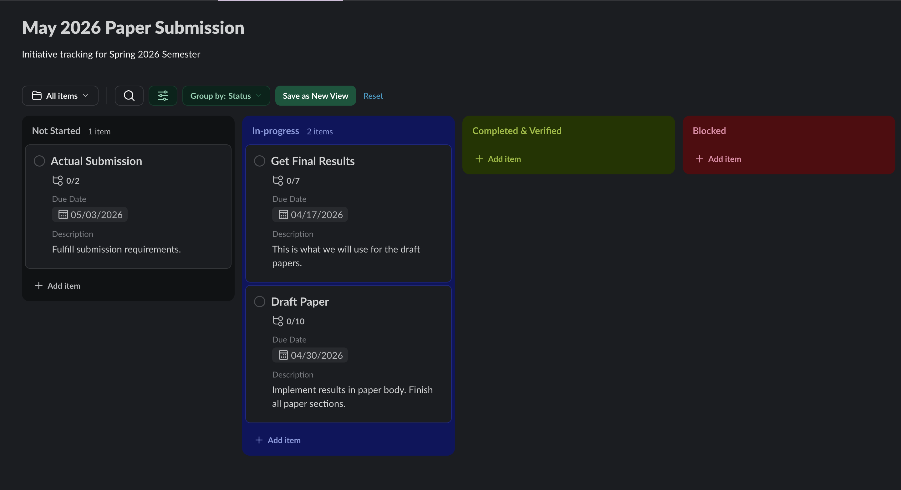
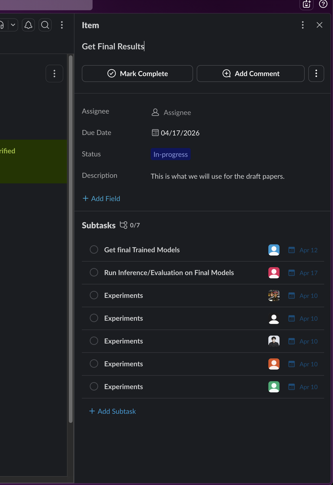

# Management & Leadership Mid-Semester Report — Initiative Questions

## Describe your initiative/procedure.

The initiative is a goal-first tracking methodology for managing research teams. Rather than focusing on what each individual researcher is doing, the system shifts attention to whether the team is making progress toward its goals. The primary tool for this is a Slack Lists Kanban board.

Work is organized into three levels:

**Initiatives** → **Goals** → **Tasks**

- **Initiatives** are the high-level outcomes the team is working toward over a semester or longer (e.g., publish a paper, speak at a conference). The board itself is typically named after the Initiative (see first screenshot).
- **Goals** are concrete, measurable deliverables that move the team closer to completing an Initiative. Each Goal needs to connect clearly to an Initiative.
- **Tasks** are smaller pieces of work that support a Goal. In this framework, Tasks are intentionally de-emphasized. The focus is on whether Goals are getting done, not on tracking every individual task.

The Kanban board uses the following columns: **Not Started**, **In Progress**, **Completed**, **Verified**, and **Blocked**. Completed and Verified can be combined into one column depending on how the team prefers to work. The manager is responsible for keeping the board organized, adding context through links and comments, and running a short weekly or bi-weekly sync to check on goal progress and velocity.

The main question for every sync is: *"Are we moving fast enough to meet our deadlines?"*

**Kanban Board:** [View Board](https://humanaugmente-e7j6563.slack.com/lists/T071VTSFLCV/F0AGD5C76DR?view_id=View0AG45LAN4X)

### Board Screenshots

---

## Explain the hypotheses/KPIs you have measured at this time and what is left to be measured.

**Hypothesis:** Research teams that track at the goal level will complete more goals on time, miss fewer deadlines, and benefit from more targeted manager support compared to teams using traditional researcher-first tracking.

**KPIs defined for measurement:**

- **Goal Achievement Rate** - Percentage of goals completed on time
- **Manager Intervention Rate** - How often the manager stepped in to help unblock a goal
- **Pain Points** - Challenges identified in each tracking approach
- **Velocity** - How quickly goals are moving through the board

**Measured so far:**

The initiative was just introduced to the CDDM group. The board has been set up and the team has been onboarded. At this point, observations are qualitative, coming from weekly meetings and syncs with the lead researcher.

**Still to be measured:**

No quantitative data has been collected yet since the system was just implemented. All KPIs will be tracked and updated as the semester continues.

---

## Explain your method for testing these hypotheses via flowcharts.

No flowchart diagrams have been created yet. The plan is to compare goal-first tracking groups against control groups using researcher-first tracking:

**Control Groups:**
- Historical data from teams that tracked individual researcher contributions
- Current teams still using traditional methods

**Experimental Groups:**
- Teams using goal-first tracking this semester, including the CDDM group

This section will be updated with visuals as the initiative develops.

---

## Explain how stakeholders are engaging with your initiative.

The initiative was introduced to the CDDM group through a kickoff meeting where the goal-oriented tracking system and the Slack Kanban board were walked through with the full team.

**Observed engagement:**

- The team was receptive and there was no pushback on adopting the new system.
- The lead researcher gave direct feedback during the kickoff, asking whether the existing PDF-based weekly progress report could be simplified. Their view was that the current format takes too much time for the value it provides.

**Reflection:**

Overall, engagement has matched expectations. The CDDM group is mature and self-sufficient, so they picked up the system quickly without much guidance needed. The feedback about the progress report was not something I anticipated, but it was useful. It shows the team is thinking about how to work more efficiently, which is in line with what this initiative is trying to do.

The faculty advisor is supportive of the general approach. That said, the CDDM group is a small, well-organized team that is close to finishing and submitting a paper. Because of that, the most useful data from this initiative will likely come from applying it to groups that have more trouble staying organized or maintaining momentum toward their goals. The CDDM group is an early test case, and the findings will be used to inform how the system is introduced to other teams.

---

## What processes have you documented or begun documenting to ensure the sustainability of your initiative?

The initiative is documented in this GitHub repository. The README covers the full methodology including the work framework, board setup, workflow, manager responsibilities, and how success will be measured.

**Documentation hosted here:**
- [README - Goal-First Tracking System](README.md)
- [Kanban Board (Slack Lists)](https://humanaugmente-e7j6563.slack.com/lists/T071VTSFLCV/F0AGD5C76DR?view_id=View0AG45LAN4X)

**Additional documentation planned:**

The README is the single source of truth right now and will be kept up to date as the initiative evolves. Depending on how things go, separate SOPs may be created:

- A **Manager SOP** covering recurring responsibilities and workflows for managers using this system.
- A **Lead Researcher SOP** covering what is expected of lead researchers when interacting with the board.

Neither of these exists yet. Whether they get created will depend on how the initiative develops over the rest of the semester.

---

## How are you currently measuring progress toward your goals?

Progress is being tracked through a few channels:

- **Weekly one-on-one syncs with the lead researcher** - Reviewing goal progress and velocity with the person closest to the research work.
- **Kanban board state** - Checking which goals are In Progress, Blocked, or Verified on the Slack board.
- **Weekly tracking spreadsheet** - Logging researcher activity and goal progress each week. [View Tracking Sheet](https://gtvault-my.sharepoint.com/:x:/g/personal/mcosta35_gatech_edu/IQCcDIQLPuJVSKWBPgkVgGCkAapcDfmTEzvk963rdX38Ygs?e=auhyic)

**Signs of progress so far:**
- The board is set up and the team has been onboarded without any issues.
- Weekly syncs with the lead researcher are now a regular part of the schedule.

**Signs of challenges so far:**
- The initiative is new, so there is no velocity data yet.
- The existing PDF progress report format has come up as a friction point that could affect how engaged researchers are with the reporting side of things.

---

## What obstacles or bottlenecks have you encountered in implementing your initiative?

**Anticipated challenges:**

Introducing any new process to a team that already has an established workflow carries some risk. The approach here was to keep the initial rollout simple and not ask the team to change too much at once. That seems to have worked so far.

**Unexpected issues:**

The feedback about the PDF progress report was not something I expected to come up during the kickoff. It is not a blocker for the initiative, but it is worth noting that existing reporting overhead could compete with adoption of the new system. Another Management student is working on addressing that separately.

Looking back, the period earlier in the semester when the team had to pivot after research results did not pan out is a good example of the problem this initiative is trying to solve. Without structured goal-level tracking, it took a few weeks to regroup and find a new direction. That kind of delay is what better visibility into goal progress is meant to help prevent.
